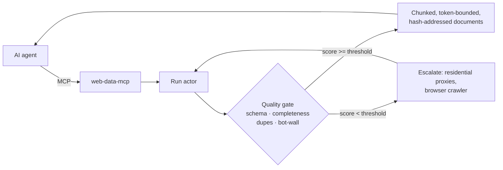

# web-data-mcp

[](https://github.com/fctpe/web-data-mcp/actions/workflows/ci.yml)
[](LICENSE)


**Quality-gated web data for AI agents.** An MCP server that runs [Apify](https://apify.com) scraping actors and — unlike a raw passthrough — validates what came back, scores it, retries with stronger anti-blocking settings when it's bad, and hands your agent embedding-ready chunks instead of a JSON dump.


Scraped data fails silently: the run "succeeds" but the dataset is a wall of `Access Denied` pages, half-empty records, or duplicates — and an agent that can't see quality will happily reason over garbage. This server makes data quality a first-class, machine-readable part of every tool result.



## Why not the official Apify MCP server?

Use both — they solve different problems.

| | [apify/apify-mcp-server](https://github.com/apify/apify-mcp-server) | web-data-mcp |
|---|---|---|
| Scope | The whole Apify store (5,000+ actors), dynamic discovery | 7 curated tools around one workflow |
| Output | Raw dataset passthrough | Schema-validated, quality-scored, token-budgeted |
| Bad scrapes | Your agent finds out the hard way | Scored (`quality.score`), auto-retried with escalating anti-blocking settings |
| RAG | Bring your own chunking | `dataset_to_rag_documents`: token-bounded chunks, overlap, stable content-hash ids |
| Guardrails | Platform-level | Actor allowlist, SSRF guard (no private hosts), clamped memory/timeouts, hard response token caps |

## Tools

| Tool | What it does |
|---|---|
| `scrape_url` | One call: crawl a URL → wait → score → auto-retry if blocked → return markdown + quality block |
| `run_actor` | Start an allowlisted actor with explicit input; returns `run_id` / `dataset_id` handles |
| `get_run_status` | Poll a run (read-only, free) |
| `fetch_dataset_items` | Paginated reads with field projection, `summary`/`items` modes, hard token budget |
| `validate_dataset` | Score a dataset against your JSON Schema: pass rate, completeness, dupes, bot-wall rate |
| `retry_low_quality_run` | Re-run with residential proxies → browser crawler until quality clears your threshold |
| `dataset_to_rag_documents` | Emit embedding-ready chunks (jsonl/markdown/text) with source attribution + content hashes |

Every tool ships `inputSchema` **and** `outputSchema` (structured output), behavior annotations (`readOnlyHint`, `openWorldHint`, …), and returns failures as model-readable `isError` results with a concrete next step — so the calling agent can self-correct instead of stalling.

### What the agent actually gets back

The point is that data quality is *structured*, not buried in prose. A `validate_dataset` result (or the `quality` block on `scrape_url`) looks like this — the agent can branch on `score`, and `sample_failures` tells it exactly what's wrong:

```jsonc
{
  "quality": {
    "score": 0.42,                    // composite 0..1 — below threshold, don't trust
    "item_count": 50,
    "schema_pass_rate": 0.30,         // 70% of items fail your JSON Schema
    "field_completeness": 0.61,
    "duplicate_rate": 0.12,
    "suspected_block_rate": 0.24,     // ~1 in 4 items look like a bot wall
    "sample_failures": [
      "item[3]/price: must be number",
      "item[7]: 'Attention Required | Cloudflare' in body"
    ]
  }
}
```

And a `dataset_to_rag_documents` line — token-bounded, source-attributed, content-hashed for idempotent upserts:

```jsonc
{ "id": "a1b2c3d4e5f6-0", "source": "https://example.com/p/12", "chunkIndex": 0,
  "chunkCount": 1, "tokenCount": 118, "content": "…clean extracted text…",
  "metadata": { "crawledAt": "2026-07-12T…" } }
```

## Quickstart

```bash
git clone https://github.com/fctpe/web-data-mcp && cd web-data-mcp
pnpm install && pnpm build

# poke every tool in a UI
APIFY_TOKEN=your-token npx @modelcontextprotocol/inspector node dist/index.js

# Claude Code
claude mcp add web-data --env APIFY_TOKEN=your-token -- node /path/to/web-data-mcp/dist/index.js

# Claude Desktop / Cursor / any stdio client — add to your MCP config:
{
  "mcpServers": {
    "web-data": {
      "command": "node",
      "args": ["/path/to/web-data-mcp/dist/index.js"],
      "env": { "APIFY_TOKEN": "your-token" }
    }
  }
}
```

(`npx -y web-data-mcp` will replace the node path once the first npm release is published — the `bin` entry is already wired.)

Free Apify accounts include $5/month of platform credit — enough for hundreds of `scrape_url` calls with the default cheerio crawler.

### HTTP mode

```bash
WEB_DATA_MCP_HTTP_TOKEN=$(openssl rand -hex 24) node dist/index.js --transport http --port 3000
```

Binds to `127.0.0.1` with Host/Origin validation (DNS-rebinding protection) and constant-time bearer auth. Built on the MCP TypeScript SDK v2 (spec 2026-07-28); 2025-era clients are served through the SDK's built-in legacy fallback.

## How the quality gate works

Each dataset sample is scored 0..1 from four signals:

- **Schema pass rate** — items validated against your JSON Schema (Ajv), weighted 0.4 when present
- **Field completeness** — non-empty cells across the union of fields
- **Duplicate rate** — hash-based duplicate detection
- **Bot-wall rate** — items containing block markers (`Access Denied`, `captcha`, `verify you are human`, …)

Below threshold, retries escalate: original input → `+ residential proxies` → `+ playwright:firefox with dynamic-content waits`. Attempts and both scores are reported in the structured result, and exhausted retries return an `isError` result that tells the agent *why* and what to try next.

## Example: LangGraph agent

[`examples/langgraph-agent`](examples/langgraph-agent) wires the server into a LangGraph agent whose system prompt enforces the quality contract ("if score < 0.7, say so instead of trusting the content"):

```bash
cd examples/langgraph-agent
npm install
OPENAI_API_KEY=... APIFY_TOKEN=... npm start -- "https://apify.com/pricing"
```

## Results: pressure-tested against production actors

Beyond the 75 offline tests, the full MCP flow (run → status → fetch → validate → RAG) was pressure-tested on 2026-07-12 against three **production** Apify actors with real workloads:

| Actor | Verdict | Quality score | Evidence |
|---|---|---|---|
| reddit-scraper-pro (keyword search) | ✅ pass | 0.989 (schema pass rate 1.0) | 54 live posts; 44 RAG docs auto-detected; token budget truncated at 6/10 items with correct continuation offset |
| event-scraper-pro (Berlin AI events) | ✅ pass | 0.903 (schema pass rate 1.0) | 28 live events; titles 100% filled; 37 RAG docs from `description` |
| facebook-ad-intelligence-pro (ad library) | ✅ pass after fix | 0.938 | 10 live ads, key fields (adCopy, headline, pageName) filled |

The live runs caught two bugs the mocked tests couldn't, both fixed with regression tests:

1. **Apify's dataset `itemCount` is eventually consistent** — it reads 0 for a few seconds after a run finishes. Pagination now floors the total at what was actually fetched.
2. **A 245-token CDN image URL out-lengthed the ad copy** in the RAG auto-detect fallback, producing well-formed garbage embeddings. Content detection now requires prose shape (whitespace ratio, non-URL) and skips items honestly instead.

## Design notes

Architecture decisions are recorded in [`docs/adr/`](docs/adr): curated tools vs. dynamic discovery, SDK v2 beta, the dependency-injected gateway that keeps the whole test suite offline and sub-second, and hard token budgets with explicit handles. Security posture (token handling, URL guard, transport auth) is in [SECURITY.md](SECURITY.md).

## Limitations

- Quality scoring is heuristic. The bot-wall regex catches common block pages, not all of them, and `field completeness` treats all fields as equally important. Schema pass rate is the signal to rely on when you can provide a schema.
- Escalation strategies (`crawlerType`, `dynamicContentWaitSecs`) target `apify/website-content-crawler`-style inputs; other actors get proxy escalation only, and unknown input keys are passed through untouched.
- `retry_low_quality_run` re-runs the *whole* actor input — it does not retry only failed URLs within a run.
- No streaming: long crawls block up to the wait budget (300s default). Fire-and-forget via `run_actor` + polling is the workaround for bigger jobs.
- Tested against `apify-client` 2.x and MCP SDK `2.0.0-beta.3` (pinned); the pin will move to v2 stable when it ships.

## Development

```bash
pnpm test        # offline test suite incl. full client<->server integration
pnpm lint && pnpm typecheck
pnpm inspect     # build + MCP Inspector
APIFY_TOKEN=... SMOKE_ACTOR=... node scripts/live-smoke.mjs   # pre-release live smoke
```

Built with AI-assisted scaffolding; architecture, quality heuristics, tool contracts, and tests are hand-designed — see the ADRs for the reasoning.

## License

[MIT](LICENSE)
